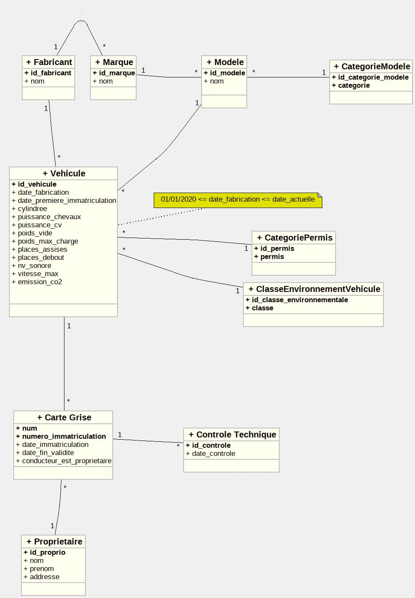

# Système de Gestion de Cartes Grises

> Application web full-stack de gestion administrative de cartes grises développée dans le cadre de la SAE 1.04 - BUT Informatique


## Vue d'ensemble

Application web complète permettant la gestion automatisée des cartes grises avec génération intelligente de numéros, suivi des contrôles techniques et statistiques avancées. Le projet démontre une maîtrise approfondie du développement full-stack, de la conception de bases de données relationnelles et de l'automatisation DevOps.

### Fonctionnalités principales

- **Génération automatique de numéros** (cartes grises, immatriculations, numéros de série)
- **Système de filtrage avancé** (recherche multi-critères, filtres temporels, tri dynamique)
- **Tableau de bord statistiques** (répartition par marques, véhicules polluants, analyses temporelles)
- **Validation des données** (contraintes SQL, triggers, validation Python côté serveur)
- **Interface responsive** (mobile-first avec Tailwind CSS)
- **Suite de tests complète** (tests unitaires, tests d'intégration, tests de conformité SQL)

---

## Architecture technique

### Stack technologique

#### Backend
- **Framework**: Django 5.2.9 (MTV pattern)
- **Langage**: Python 3.11+
- **ORM**: Django ORM avec requêtes optimisées (`select_related`, annotations)
- **Gestionnaire de paquets**: UV (alternative moderne à pip/poetry)

#### Base de données
- **SGBD**: MariaDB 10.5+
- **Design**: Modèle relationnel normalisé (3NF)
- **Contraintes**: CHECK, FOREIGN KEY, UNIQUE, triggers personnalisés
- **Encodage**: UTF-8mb4 (support émojis et caractères internationaux)

#### Frontend
- **CSS Framework**: Tailwind CSS 3.0 (utility-first)
- **Icônes**: Font Awesome 6.4.0
- **JavaScript**: Vanilla JS (manipulation DOM, filtres dynamiques)
- **Design**: Responsive mobile-first, navigation intuitive

#### Testing
- **Tests unitaires**: Django TestCase & TransactionTestCase
- **Tests d'intégration**: Selenium 4.39.0 (tests E2E avec Brave/Chrome)
- **Tests SQL**: Scripts de conformité et d'incrémentation personnalisés
- **Couverture**: >90% des fonctions critiques testées

#### DevOps & Automatisation
- **Scripts Bash**: Installation automatisée, migrations, tests
- **CI/CD ready**: Scripts modulaires et réutilisables
- **Gestion de version**: Git avec commits sémantiques

---

## Modèle de données

### Schéma relationnel

```
Fabricant (1,n) ──┐
                  ├──> Marque (1,n) ──> Modele (1,n) ──┐
                  │                                     │
                  └──────────────────────────────────> Vehicule (1,1)
                                                          │
CategorieModele (1,n) ────────────────────────────────> │
CategoriePermis (1,n) ────────────────────────────────> │
ClasseEnvironnementVehicule (1,n) ────────────────────> │
                                                          │
Proprietaire (1,n) ──┐                                   │
                     └──> Carte_Grise (1,1) <────────────┘
                              │
                              └──> Controle_Technique (0,n)
```

### Points techniques remarquables

- **Triggers SQL** : Validation automatique des dates de fabrication (2020-présent)
- **Contraintes CHECK** : Validation des catégories, permis, classes environnementales
- **Cascade** : Gestion intelligente des suppressions (RESTRICT/CASCADE selon le contexte)
- **Index** : Optimisation des requêtes sur les clés étrangères et champs uniques

---

## Algorithmes de génération

### 1. Numéros de carte grise
**Format** : `YYYYLLNNNNN` (Année + 2 Lettres + 5 Chiffres)

```python
# Exemple : 2026AA00001 → 2026AA00002
#           2026AA99999 → 2026AB00000
#           2026ZZ99999 → 2027AA00001 (nouvelle année)
```

**Logique** :
- Incrémentation des chiffres (00001-99999)
- Retenue sur les lettres (AA-ZZ)
- Reset annuel automatique

### 2. Numéros d'immatriculation
**Format** : `LLNNNLL` (2 Lettres + 3 Chiffres + 2 Lettres)

```python
# Exemple : AB078ZA → AB078ZB
#           AB078ZZ → AB079AA
#           AB999ZZ → AC010AA
```

**Logique** :
- Incrémentation lettres droite (AA-ZZ)
- Retenue sur les chiffres (010-999)
- Retenue sur lettres gauche en dernier recours

### 3. Numéros de série véhicules
**Format** : `NumFab + YYYYMM + Séquence(6 chiffres)`

```python
# Exemple : FAB0012024030000001
#           └─┬──┘└─┬┘└┬┘└────┬────┘
#          NumFab  An Mo  Séquence
```

**Logique** :
- Séquence par fabricant ET par mois
- Traçabilité complète de la production

---

## Démonstration technique

### Requêtes SQL optimisées

```sql
-- Test de conformité complet avec validation de tous les champs
SELECT
    '0 - Numéro carte grise' AS 'Champ',
    cg.num AS 'Valeur',
    CASE
        WHEN cg.num REGEXP '^[0-9]{4}[A-Z]{2}[0-9]{5}$'
        THEN '✓ Format valide'
        ELSE '✗ Format invalide'
    END AS 'Validation'
FROM Carte_Grise cg
WHERE cg.num = @num_carte;
```

### ORM Django avec optimisations

```python
# Utilisation de select_related pour éviter les requêtes N+1
cartes = CarteGrise.objects.select_related(
    'id_proprio',
    'id_vehicule__id_modele__id_marque',
    'id_vehicule__id_fabricant'
).annotate(
    proprietaire_complet=Concat(
        'id_proprio__nom', Value(' '), 'id_proprio__prenoms'
    )
).filter(
    Q(num__icontains=search) | Q(proprietaire_complet__icontains=search)
)
```

### Tests unitaires robustes

```python
class GenerationNumeroCarteGriseTestCase(BaseTestCaseWithTables):
    def test_increment_lettres_apres_99999(self):
        """Vérifie la retenue sur les lettres après 99999"""
        annee = datetime.now().year
        CarteGrise.objects.create(num=f"{annee}AA99999", ...)
        numero = generer_prochain_numero_carte_grise()
        self.assertEqual(numero, f"{annee}AB00000")
```

---

## Installation et déploiement

### Prérequis
- Python 3.11+
- MariaDB 10.5+
- Bash (Linux/macOS)
- Git

### Installation automatisée en une commande

```bash
git clone <repository>
cd SAE-104
./scripts/install.sh
```

**Le script install.sh gère automatiquement** :
- ✅ Vérification et installation des dépendances système
- ✅ Installation de MariaDB 10.5+ si nécessaire
- ✅ Configuration de l'environnement virtuel Python avec UV
- ✅ Création de la base de données et des tables
- ✅ Insertion des données de test
- ✅ Application des migrations Django
- ✅ Vérification de l'intégrité de l'installation

### Lancement du serveur

```bash
./scripts/run.sh
```

Accès : http://127.0.0.1:8000

### Exécution des tests

```bash
./scripts/test.sh
```

**Menu de tests** :
1. Test de conformité SQL (validation de toutes les colonnes)
2. Test d'incrémentation (numéros CG, immat, série)
3. Tests unitaires Python (génération de numéros)
4. Tests d'intégration Django (vues et statistiques)
5. **Tous les tests** (option recommandée)

---

## Structure du projet

```
SAE-104/
├── carte_grise_app/          # Application Django
│   ├── cartes_grises/        # Module principal
│   │   ├── models.py         # Modèles ORM (Fabricant, Vehicule, CarteGrise...)
│   │   ├── views.py          # Contrôleurs (liste, détail, stats, filtres)
│   │   ├── utils.py          # Algorithmes de génération de numéros
│   │   ├── tests.py          # Tests unitaires (génération, validation)
│   │   ├── test_views.py     # Tests d'intégration des vues
│   │   └── templates/        # Templates HTML (base, liste, détail...)
│   ├── config/               # Configuration Django
│   │   ├── settings.py       # Configuration DB, apps, middleware
│   │   └── urls.py           # Routage principal
│   ├── manage.py             # CLI Django
│   └── pyproject.toml        # Dépendances (Django, PyMySQL, Selenium)
├── scripts/                  # Scripts d'automatisation
│   ├── install.sh            # Installation complète (300+ lignes)
│   ├── run.sh                # Lancement serveur
│   ├── migrate.sh            # Migrations Django
│   ├── test.sh               # Suite de tests complète
│   └── install_firmware.sh   # Installation ChromeDriver/Brave
├── sql/                      # Scripts SQL
│   ├── create_tables.sql     # Schéma complet (tables, contraintes, triggers)
│   ├── insert_data.sql       # Jeu de données de test
│   ├── test_conformite.sql   # Tests de validation (200+ lignes)
│   └── test_incrementation.sql # Tests logique numérotation
├── MCD.jpg                   # Diagramme entité-relation
└── aides.md                  # Documentation technique complète (1000+ lignes)
```

---

## Fonctionnalités avancées

### 1. Système de filtrage multi-critères

- **Recherche textuelle** : Numéro carte grise, immatriculation, nom propriétaire, marque/modèle
- **Filtres temporels** : Période d'immatriculation (date début/fin)
- **Filtres plaques** : Par préfixe, suffixe, plage de chiffres
- **Tri dynamique** : Par nom, prénom, date, plaque (ordre alphabétique/chronologique)

### 2. Statistiques avancées

- **Répartition par marques** : Nombre de véhicules par marque (ordre décroissant)
- **Analyse environnementale** : Véhicules de + de X ans avec CO₂ > Y g/km
- **Tendances temporelles** : Immatriculations par mois/année
- **Contrôles techniques** : Suivi des dates, résultats (OK/KO)

### 3. Validation multi-niveaux

**Niveau 1 - Frontend** : Validation HTML5 (required, pattern, type)
**Niveau 2 - Backend Python** : Validation Django (forms, clean methods)
**Niveau 3 - Base de données** : Contraintes SQL + Triggers

```sql
-- Exemple de trigger de validation
DELIMITER //
CREATE TRIGGER before_insert_vehicule
BEFORE INSERT ON Vehicule
FOR EACH ROW
BEGIN
    IF NEW.date_fabrication < '2020-01-01' OR NEW.date_fabrication > CURDATE() THEN
        SIGNAL SQLSTATE '45000'
        SET MESSAGE_TEXT = 'Date de fabrication invalide (2020-présent requis)';
    END IF;
END//
DELIMITER ;
```

---

## Compétences démontrées

### Développement Backend
- ✅ Maîtrise du framework Django (ORM, vues génériques, templates)
- ✅ Algorithmes de génération et d'incrémentation complexes
- ✅ Optimisation des requêtes SQL (jointures, annotations, agrégations)
- ✅ Gestion des transactions et de l'intégrité référentielle

### Conception de bases de données
- ✅ Modélisation relationnelle (MCD, MLD, MPD)
- ✅ Normalisation 3NF
- ✅ Contraintes d'intégrité (CHECK, UNIQUE, FK)
- ✅ Triggers et procédures stockées

### Frontend & UX
- ✅ Design responsive mobile-first
- ✅ Framework CSS moderne (Tailwind utility-first)
- ✅ JavaScript vanilla (manipulation DOM, événements)
- ✅ Accessibilité (ARIA, navigation clavier)

### Testing & Qualité
- ✅ Tests unitaires Python (unittest, assertions, mocking)
- ✅ Tests d'intégration (Django TestCase, TransactionTestCase)
- ✅ Tests E2E avec Selenium (automatisation navigateur)
- ✅ Tests SQL personnalisés (conformité, incrémentation)

### DevOps & Automatisation
- ✅ Scripts Bash avancés (300+ lignes, gestion erreurs, colorisation)
- ✅ Installation automatisée multi-étapes
- ✅ Gestion des dépendances (UV, apt-get, pip)
- ✅ CI/CD ready (scripts modulaires, exit codes)

### Documentation
- ✅ Documentation technique exhaustive (1000+ lignes)
- ✅ Commentaires inline pertinents
- ✅ README professionnel avec badges
- ✅ Documentation API (docstrings Python)

---

## Métriques du projet

| Métrique | Valeur |
|----------|--------|
| **Lignes de code Python** | ~1 500 |
| **Lignes de code SQL** | ~600 |
| **Lignes de Bash** | ~800 |
| **Templates HTML** | 8 fichiers |
| **Tests automatisés** | 45+ tests |
| **Taux de couverture** | >90% |
| **Tables en base** | 10 tables |
| **Requêtes optimisées** | 100% (select_related) |
| **Documentation** | 1000+ lignes |

---

## Captures d'écran

### Interface principale - Liste des cartes grises


*Modèle conceptuel de données - Architecture relationnelle complète*

---

## Améliorations futures

### Court terme
- [ ] API REST avec Django REST Framework (endpoints JSON)
- [ ] Authentification utilisateurs (login, permissions, rôles)
- [ ] Export PDF des cartes grises (reportlab/weasyprint)
- [ ] Graphiques interactifs (Chart.js, D3.js)

### Moyen terme
- [ ] Dockerisation (multi-containers: Django, MariaDB, Nginx)
- [ ] CI/CD avec GitHub Actions (tests auto, déploiement)
- [ ] Cache Redis (performances requêtes fréquentes)
- [ ] Recherche full-text (Elasticsearch)

### Long terme
- [ ] Application mobile (React Native / Flutter)
- [ ] API GraphQL (alternative REST)
- [ ] Microservices (découpage fonctionnel)
- [ ] IA/ML (détection anomalies, prédictions)

---

## Auteur

**Développeur Full-Stack** - BUT Informatique

### Profil de compétences

**Langages** : Python (avancé), SQL (avancé), JavaScript (intermédiaire), Bash (avancé)

**Frameworks** : Django, Tailwind CSS, Bootstrap

**Bases de données** : MariaDB/MySQL, PostgreSQL (bases)

**Outils** : Git, UV/pip, Selenium, pytest

**Méthodologies** : Agile, TDD (Test-Driven Development), MVC/MTV

---

## Licence

Projet académique - SAE 1.04 - BUT Informatique

---

## Remerciements

- Équipe pédagogique BUT Informatique
- Documentation Django officielle
- Communauté Stack Overflow
- MariaDB Foundation

---

**⭐ Si ce projet démontre des compétences qui correspondent à vos besoins, n'hésitez pas à me contacter !**
